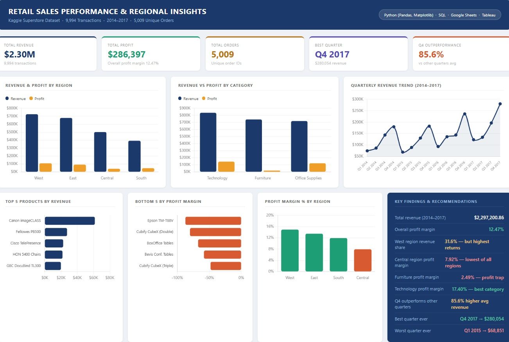

# Retail Sales Performance & Regional Insights

## Project Overview
Analyzed 9,994 retail transactions from the Kaggle Superstore dataset 
spanning 2014–2017 to uncover revenue trends, regional performance, 
category profitability, and product-level insights.

## Tools Used
- **Python** (Pandas, Matplotlib) — data cleaning, EDA, visualization
- **SQL** — data extraction and aggregation queries
- **Google Sheets** — pivot tables and chart building
- **Tableau** — interactive regional dashboard

## Dataset
- Source: [Kaggle Superstore Sales Dataset](https://www.kaggle.com/datasets/vivek468/superstore-dataset-final)
- Records: 9,994 transactions
- Period: 2014–2017
- Features: Region, Category, Product, Sales, Profit, Order Date

## Key Findings
- Total Revenue: **$2,297,200.86** across 5,009 unique orders
- Overall Profit Margin: **12.47%**
- West region contributes **31.6% of revenue** but has the highest return rate
- Central region has the **lowest profit margin at 7.92%**
- **Furniture is a profit trap** — high revenue ($741,999) but only 2.49% margin
- Technology is the **best performing category** at 17.40% margin
- **Q4 outperforms other quarters by 85.6%** — every single year
- Best quarter ever: **Q4 2017 → $280,054**

## Results by Region
| Region | Revenue | Profit | Margin |
|---|---|---|---|
| West | $725,457 | $108,418 | 14.94% |
| East | $678,781 | $91,522 | 13.48% |
| Central | $501,239 | $39,706 | 7.92% |
| South | $391,721 | $46,749 | 11.93% |

## Results by Category
| Category | Revenue | Profit | Margin |
|---|---|---|---|
| Technology | $836,154 | $145,454 | 17.40% |
| Furniture | $741,999 | $18,451 | 2.49% |
| Office Supplies | $719,047 | $122,490 | 17.04% |

## Recommendations
1. **Review Furniture pricing** — especially tables and bookcases 
   selling at negative margins
2. **Plan for Q4 six months in advance** — 85.6% revenue spike 
   every year needs early inventory and staffing prep
3. **Investigate West region return rate** before increasing 
   marketing spend there

## Files
| File | Description |
|---|---|
| `retail_sales_analysis.ipynb` | Python notebook — cleaning, SQL, EDA, charts |
| `data_extraction.sql` | SQL queries for all aggregations |
| `superstore_cleaned.csv` | Cleaned dataset |
| `dashboard_preview.png` | Dashboard screenshot |
